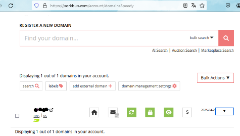
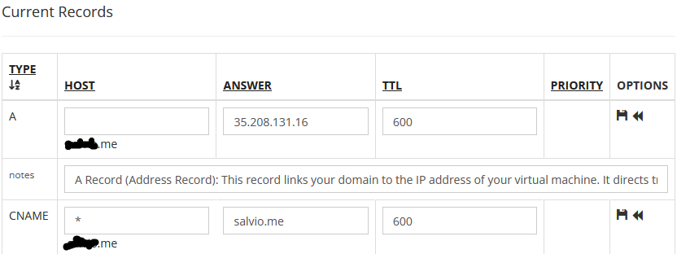

# Disclaimer
This file is a work in progress. Its my first time deploying the template, and I haven't finished yet, therefore there might be errors in it.

# About the structure of the project 
docker-compose.override.yml is used used only for local development - local deployment. 
For example, the directory with the backend code is mounted as a Docker "host volume", mapping the code you change live to the directory inside the container. That allows you to test your changes right away, without having to build the Docker image again.

# Intro

This project is based on https://github.com/tiangolo/full-stack-fastapi-template

Steps to build a project like this one:
1. Install copier locally if not installed:
``` pip install copier ```

2. Create a folder for your project

3. Open a command line in the folder that contains your project folder

4. Use copier to copy the template: 
``` python -m copier copier copy https://github.com/tiangolo/full-stack-fastapi-template ProjectFolderName --trust ```

5. Fill the form
- To generate a secret use ``` python -c "import secrets; print(secrets.token_urlsafe(32))" ``` in a bash command line
- For the super user name i used my own, not sure if its a great idea.
- For the password you can generate it with the same command, possibly with a different length ``` python -c "import secrets; print(secrets.token_urlsafe(20))" ```
- for the SMTP server you can use the one for your mail provider. For example: smtp.gmail.com
- for the user you can use your mail, for example: your.mail@gmail.com
- for the password its the password you use for your mail.
- for the user to send mails from, i guess its your mail again: your.mail@gmail.com
- Also generate the password for posgre: python -c "import secrets; print(secrets.token_urlsafe(32))"
- Sentry is not necesary, so just hit enter

6. Your project should contain everythng it needs to work, but **BE CAREFUL NOT TO push your .env to source control!!!** You probably need to gitignore it, I dont have a clue why they didnt make copier ignore it by default. Also, gitignoreing it you will need to discard the tracking from the file, which i dont remember how to do from memory, i will add it later.

7. Lets make sure the project is working locally first. Run docker engine, for example by running docker desktop, then run ```docker compose up -d ```, check that http://localhost and http://localhost/docs are working. We have the traefik container up and running, hurray! 

8. Ok, now we need to deploy it. I'll be deploying in a virtual machine, for simplicity(its easy to just install and use docker compose) and flexibility (you can use a vm in any cloud, or even a physical server).

To be specific I'll deploy on GCP, which has a VM on the only free tier. With my current setup and the current free tier limitations we only need to pay for the static ip (~0.3 usd/month), to connect it with your domain, and for your domain. It should be possible to skip paying for the static ip, and even for the domain, but I didn't want to have to modify the project too much, and its not designed for that.

To create a vm on gcp, first create a gcp account, go to console, then create a project, and then go to google compute engine, activate the api, and click on create instance.

You need to configure some things. While all my settings except possibly static ip were free at the time, be sure to keep a mind on costs, setup budget alerts and check https://cloud.google.com/free/docs/free-cloud-features#compute  .
These are the settings you need:
- Set the name to a name you want, for example portfolio-compute-instance
- Set the region to a region in the free tier, for example right now its us-central1 (Iowa)
- Activate the e2 micro preset
- Skip the container setting, its for when you use a container optimiezed os, which has a different setup since its meant to run a single container. 
- Boot disk: Use Debian linux 12, Choose standard persitent disk, since its in free tier and cheaper, though i believe the other may be too since i wasnt charged for it. make sure to go for 30gb. 10gb wont be enough, and it should still be free.
- Firewall: allow http and https traffic 
- Advanced options > networking > networking interfaces settings: **FIRST change your network service tier to standard** then click on external ipv4 and reserve a static external ip address, since to add a domain it will be necessary. Select a name for example: portfolio-vm-external-static-ipv4

10. Now you have a working vm, and you need a domain so people can access to your vm by url instead of ip. Additionally it is needed to not need to modify the project and be able to follow this instructions as is.

First, get the external ip of your vm, it'll be available on the table on https://console.cloud.google.com/compute/instances?onCreate=true&project=your-projectname

Now get a domain:
I suggest you get a domain like lastname.me . You can buy it at any DNS registrar, but I used porkbun, and I suggest you do the same, its cheap, has good support, and gives some features that are usually paid for for free.

After buying your domain, we need to create some DNS records to redirect traffic from your domain to the vm. Go to settings on your DNS registrar page, in porkbun they are on https://porkbun.com/account/domainsSpeedy on the dns label under your domain:


You need 2 records:
- An A (address) record with your domain host pointing to the Public IP of your vm.
- A cname record with all subdomains as source (*) and your domain as target.

On porkbun there are 2 default records, scroll to the bottom of the page to find them and mofiying, they should look like this but with your domain and ip. Dont forget to hit the save button nex tto each record.


Now, your domain will still not be working, since your vm is not doing anything, and since the DNS server doesn't instantaniously update. TTL is the time till update (max), in porkbun its 600s minimun (10 minutes), but on your dns server it may be longer.

Anyhow, your domain should update eventually, so don't worry about it for now, lets hop back to the vm.

9. Now that you have your domain, and your vm is created, we need to configure the vm to actually do something. We'll mostly follow the project's [deployment guide](https://github.com/tiangolo/full-stack-fastapi-template/blob/master/deployment.md) but not exactly since it doesn't work as is.

11. First get the Now we need to get into the command line of the vm to run some commands. Go to vm instances if not there already, and click on ssh.


You may be asked to create a passphrase. If so, do so, save it somewhere safe along with the results of the command. You might need it in the future.

You can run ```echo hello world``` to make sure the cmdline is working.

12. Now that you are in the command line you will need to install docker & docker compose before running anything. To do so we'll follow the official docker instructions. If following my guide, we'll use the[ones for debian.] (https://docs.docker.com/engine/install/debian/#install-using-the-repository):
Copy and paste this to the terminal:
```bash
# Add Docker's official GPG key:
sudo apt-get update
sudo apt-get install ca-certificates curl
sudo install -m 0755 -d /etc/apt/keyrings
sudo curl -fsSL https://download.docker.com/linux/debian/gpg -o /etc/apt/keyrings/docker.asc
sudo chmod a+r /etc/apt/keyrings/docker.asc

# Add the repository to Apt sources:
echo \
  "deb [arch=$(dpkg --print-architecture) signed-by=/etc/apt/keyrings/docker.asc] https://download.docker.com/linux/debian \
  $(. /etc/os-release && echo "$VERSION_CODENAME") stable" | \
  sudo tee /etc/apt/sources.list.d/docker.list > /dev/null
sudo apt-get update
```
And then this:
```bash
sudo apt-get install docker-ce docker-ce-cli containerd.io docker-buildx-plugin docker-compose-plugin
```
Type Y and enter when prompted to do so.

Its not necessary, but you can run ```sudo docker run hello-world``` to verify everything is working. Then to cleanup ```sudo docker ls --all``` to find the id of the hello world container and then ```sudo docker rm theid``` to remove the hellow world container you installed. 

13. Now we need to upload the docker compose traefik file and run some more commands to start the traefik proxy. 
Since the default guide uses prievilieged folders, we;; need to run many commands using sudo, since they are configured to place files on privilieged folders such as root which we cant access otherwise.

First create the target directory:
Run: ```sudo mkdir -p /root/code/traefik-public/```
You will not get any messages after creating the directory, its normal, dont worry.

Then upload docker-compose.traefik:
Instead of running rsync, upload the file by using the upload file button on the top right corner of the console, and clicking upload. 
You will only be able to upload to home apparently, so just upload it and then move it by running: ```sudo mv docker-compose.traefik.yml /root/code/traefik-public/ ```
Alternatively I think you can upload the file with rsync, using the external ip listed in the vms table instead of the domain name on the conneciton.
Alternatively click on the arrow next to ssh open cloud command and run it in the console and upload on the right. You might be asked to create a passphrase or enter it. if you were asked to create make sure to save it somewhere safe.
Keep in mind that if you close the terminal at some point without having moved the file it might disappear/ no longer be listed.


Now create the traefik public network since the compose files use it:
```sudo docker network create traefik-public```

And set the enviromental variables for traefik:
**Change username, password, domain, and email and copy paste this:**
```bash
export USERNAME=changethis
export PASSWORD=changethis
export HASHED_PASSWORD=$(openssl passwd -apr1 $PASSWORD)
export DOMAIN=change.this.com
export EMAIL=change@this.com
```
**Save the details somewhere safe.** 

Now we need to start the traefik docker compose, but to do so we need to run the command in /root/code/traefik-public/ . To achieve it run this:
``` sudo -E sh -c 'cd /root/code/traefik-public/ && docker compose -f docker-compose.traefik.yml up -d' ```
We use the -E flag to make sure that sudo takes into account the existing enviromental variables.

You should get a message that your traefik container is now running.

This might be helpful reference if i run into problems there: https://youtu.be/CSQTnZEoC1o?si=7BKwG4XHNO8Y-RqE&t=846

14. Now that the traefik proxy is up, we need to run our project (backend, frontend, database, etc).
Again, we'll mostly follow the instructions in the [official guide](https://github.com/tiangolo/full-stack-fastapi-template/blob/master/deployment.md#deploy-the-fastapi-project), but with some caveats.

We  need to prepare the enviromental variables to copy paste. Before that we could try to configure env variablles [the enviromental variables required for github actions](https://github.com/tiangolo/full-stack-fastapi-template/blob/master/deployment.md#github-actions-environment-variables) but i get the feeling that excluiding smokeshow which just shows code coverage, the tempalte should work without configuring them, so I'll skip setting:
- LATEST_CHANGES is the enviromental variable for last changes github token, but I believe this is the default value is  ${{ secrets.GITHUB_TOKEN }} which should work because of https://docs.github.com/en/actions/security-guides/automatic-token-authentication
- SMOKESHOW_AUTH_KEY Used to handle and publish the code coverage using Smokeshow, follow their instructions to create a (free) Smokeshow key. Ill skip since it likely should work without it.

Now prepare the variables for copy pase. Some of them you should obtain from your .env file which was created by copier on the project folder.
```bash
#General
export ENVIRONMENT=production
export DOMAIN=yourlastname.me
export PROJECT_NAME=obtain-from-.env
export STACK_NAME=production-your_project_name-stack
#This may be and likely is totally wrong TODO CHANGE:
export BACKEND_CORS_ORIGINS="http://localhost,http://localhost:5173,https://localhost,https://localhost:5173,http://localhost.tiangolo.com"
export SECRET_KEY=obtain-from-.env
export FIRST_SUPERUSER=obtain-from-.env
export FIRST_SUPERUSER_PASSWORD=obtain-from-.env
#Lets not allow new users registration as of yet
export USERS_OPEN_REGISTRATION=False

# Emails
export SMTP_HOST=obtain-from-.env
export SMTP_USER=obtain-from-.env
export SMTP_PASSWORD=obtain-from-.env
export EMAILS_FROM_EMAIL=obtain-from-.env

# Postgres
export POSTGRES_SERVER=obtain-from-.env
export POSTGRES_PORT=obtain-from-.env
export POSTGRES_DB=obtain-from-.env
export POSTGRES_USER=obtain-from-.env
export POSTGRES_PASSWORD=obtain-from-.env
```

Ok, now we have the enviromental variables set, so if we uploaded and ran our project with ```docker compose -f docker-compose.yml up -d```. It'd be nice to do so and test the project, but unfortunately the instructions skip it so we will too.

**Usually, now we'd setup CI/CD, but the chances of it going wrong arent very slim, so lets first make sure our container runs properly.**
first make sure to build your backend and frontend.
Look for your repository variables, or the name of your repository on docker hub. it should look something like this: your_docker_hub_name/your_project_name-backend . build the images, using those :latest
It might seem irrelevant but make sure to use latest as tag, since thats what the docker compose file will look for.
docker build -t your_docker_hub_name/your_project_name-backend-backend:latest ./backend
docker build -t your_docker_hub_name/your_project_name-backend-frontend:latest ./frontend
docker push your_docker_hub_name/your_project_name-backend-backend:latest
docker push your_docker_hub_name/your_project_name-backend-frontend:latest

create a personal access token with read access, and run
docker login -u yourusername
paste personal access token and press enter

sudo docker pull your_docker_hub_name/your_project_name-backend-backend:latest
sudo docker pull your_docker_hub_name/your_project_name-backend-frontend:latest

Set the additional enviromental variables normally passed by github actions:
```bash
# Additional vars for manual deployment
export DOCKER_IMAGE_BACKEND=your_docker_hub_name/your_project_name-backend
export DOCKER_IMAGE_FRONTEND=your_docker_hub_name/your_project_name-frontend
#please note that we dont include latest as the tag, as the docker compose file automatically looks for latest tag, and otherwise would look for your_docker_hub_name/your_project_name-backend-backend:latest:latest and fail .
```

upload the docker compose file. using upload file.
``` sudo mkdir -p /root/code/project-compose/ ```
``` sudo mv docker-compose.yml /root/code/project-compose/ ```
``` sudo -E sh -c 'cd /root/code/project-compose/ && docker compose -f docker-compose.yml up -d' ```

If you try to run docker-compose.yml you'll notice that it requests a .env file.
To be frank most if not all of the environmental variables are already setup, so im not really sure its necessary from a functional standpoint. But for simplicity's sake, upload the .env file generated by copier, just make sure that all the variables are in line with what you want as environmental variables and have exported as env variables.
If you are wondering wether you could've just uploaded that file, without setting any env variables, I believe the answer may be no, because some env variables are used on docker-compose.yml itself, and as such might not be loaded in time, but its just my hypothesis.

upload the .env file
Move it to the right place:
``` sudo mv .env /root/code/project-compose/ ```
sudo mv .env /root/code/project-compose/

If you get these errors:
unable to prepare context: path "/root/code/project-compose/frontend" not found
unable to prepare context: path "/root/code/project-compose/backend" not found
Use:
sudo mkdir -p /root/code/project-compose/frontend
sudo mkdir -p /root/code/project-compose/backend
But you shouldnt get those erors I believe since i think they should only appear on build stage which should never happen on the vm. Specifically, the build would still fail if the build stage tried to run on the container since it doesnt have the source, and therefore context would complain that there is no docker file.

Ok, now the project should succesfully run, not bad huh :D?

Now you can go to your domain. It should show you the typical login page.

You can see the logs of your docker compose app by running:
sudo -E sh -c 'cd /root/code/project-compose/ && docker compose -f docker-compose.yml logs'

You can see the currently running containers and their status by running:
sudo -E sh -c 'cd /root/code/project-compose/ && docker compose ps'

You can stop the compose by running:
sudo -E sh -c 'cd /root/code/project-compose/ && docker compose -f docker-compose.yml down'

You can attach a command line to a container by running:
```bash
sudo su # to enter super user mode` 
`cd /root/code/project-compose/`
```
```docker compose attach frontend``` or whatever service name.
If you need to exit that command line just run exit.

Dont forget to shutdown docker compose before going for ci. Otherwise you might try to run both at once which will lead to issues.
cd /root/code/project-compose/
docker compose down

I should (and probably will)  change this guide to place the docker compose manually on the same place github actions will place it, to avoid any potential issues and unnecesary files.


Now lets set things up so they are automatically deployed instead! Not bad huh?
Again, we'll follow [the guide](https://github.com/tiangolo/full-stack-fastapi-template/blob/master/deployment.md#continuous-deployment-cd), but with some modifications:
First execute these commands. The point is to create a user in your vm so we can install the runners there.
```bash
# add the user with useradd instead of adduser, use sudo or the command wont be found
sudo useradd -m github

# Add Docker permissions to the github user, use sudo or the command wont be found
sudo usermod -aG docker github

# Change to the github user, use sudo or it will ask for a password that i dont know where to find.
sudo su - github

# change to the base directory of github user
cd
```

To find that folder as root, simply do cd home/github . To see the folder where workers will place files by default do cd home/github/_work

Now we need to do some things on your github repository. Make sure to create a github repository for the project, and locally add it as a remote to push to. You can do it very simply on vs code by using the git symbol on and then push to, add remote.

Now you need to go to your repo settings (on actions, runners, linux, x64) and copy paste the commands to your vm console to install a github runner on your vm, so we can run it.
https://github.com/your-user/your-repo/settings/actions/runners/new?arch=x64&os=linux

Feel free to use the default settings whenever pronted to do so, but you may want to add a label for production, and may want to skip the actual running.

_work folder is default
The runner is almost operational, but we need to make it run as a service so its never offline.
Go back to the vm. Run ```exit``` to go back to the root user. 

run:
```bash
cd /home/github
sudo ./svc.sh install github
sudo ./svc.sh start
```
Now it should be operational, you can check it on github.com/yourname/yourproject/settings/actions/runners
You can also run:
sudo ./svc.sh status

Now we also need to configure the secrets in the github repository:
Go to 
https://github.com/your_user/your_project/settings/secrets/actions
And add as repository secrets the environmental variables you had set for: 
- DOMAIN_PRODUCTION (just used the domain here and in staging)
- DOMAIN_STAGING
- STACK_NAME_PRODUCTION (used the stack name id configured for production, and the same with stagging ending instead of production for the next variable)
- STACK_NAME_STAGING
- EMAILS_FROM_EMAIL
- FIRST_SUPERUSER
- FIRST_SUPERUSER_PASSWORD
- POSTGRES_PASSWORD
- SECRET_KEY
- LATEST_CHANGES (i added just initial commit as value dont know if its ok)
- SMOKESHOW_AUTH_KEY (i skipped it for now)

Ok, so if you have a powerful vm, your CI setup is finished. But if you've been following my tutorial, that is not the case. E2 micro vm does not have enough processing power for the actions created by tiangolo to work, since it tries to build the docker image on the VM, and that will fail with our processing power.

Instead we'll build our docker image with github actions, and push it to docker hub, and then pull it from docker hub on our vm. That way the build process takes place outside the vm.

To achieve it first we need to create some more github secrets, so that github and our vm can connect to docker hub.
Instead of giving the password to our vm and github workflow, [create a docker hub token, like explained here](https://docs.docker.com/security/for-developers/access-tokens/). Then add the username and token returned as github secrets with these names:
- DOCKERHUB_USERNAME
- DOCKERHUB_TOKEN

Also create a repository on dockerhub for the backend of this project, and another for the frontend, and create a github variable github.com/yourname/portfolio/settings/variables/actions with each path, for example 
- DOCKERHUB_REPOSITORY_BACKEND yourdockerhubuser/your-repo-backend
- DOCKERHUB_REPOSITORY_FRONTEND youdockerhubruser/your-repo-frontend

Ok, now download from this repository/.github the workflows starting with alt_ . They are the alternative workflows with the process i described.

Commit and push the workflows to the correct remote.** Make sure NOT to push .env and .copier-answers.yml . It will leak security information if your repo is public!**
I believe the reason that they might have not gitignored .env is to make it available with the github checkout workflow, but it could be done with actions and github secrets, and in my opinion thats a better approach and what i followed.

You can see that on the workflows that ran with your CI/CD at https://github.com/youruser/yourrepo/actions

Our current github actions settings will run the following workflows on commit:
- Test
- Deploy to staging 
- Smokeshow
Keep in mind they may not be instantaniously ran, but instead queued.

Creating a new release on github will run the following workflows:
- Deploy to Production
- Build and push to docker hub.


# Debugging
# Github workflows are queued/ runner is inactive
- Sometimes you may notice that your github workflows that depend on your self hosted runner are queued but not actually running.
- You can check that your runner is correctly running at: github.com/yourusername/yourproject/settings/actions/runners
- And you may find that status is inactive. This means there is a problem at the vm. You may try to restart the runner, to do so connect via ssh to your vm like we did during the installation, and execute:
```bash
cd /home/github/actions-runner
sudo ./svc.sh start
```
- If ssh connection fails, your vm may be not responding, try restarting the vm and it will automatically restart the runner.

# Workflow fails (TODO expand)
First go to the workflow logs on github actions, then you can also see: https://docs.github.com/en/actions/hosting-your-own-runners/managing-self-hosted-runners/monitoring-and-troubleshooting-self-hosted-runners

You can also disable the workflow temporairly if you need the rest of the workflows to run without issue, but can desactivate that one with no problem. to do so go to actions, workflow name, and click disable, see [this](https://docs.github.com/en/actions/using-workflows/disabling-and-enabling-a-workflow) for more info

# VM not responding
- A problem during the run of a runner may cause your runnner to become inactive and your vm to stop responding to ssh.
- If your vm starts responding you can try shutting it down, and starting it again, this may fix the issue. Connect via ssh to verify if it did. Do not forget to restart your traefik server since it'll be shutdown.

